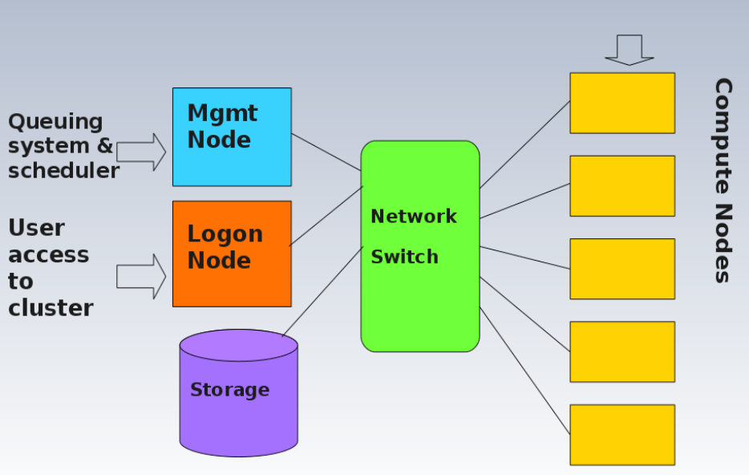

# Cluster and Cloud Computing (COMP90024)

## Week 1

### Cloud Characteristics
– On-demand self-service . A consumer can provision computing
capabilities as needed without requiring human interaction with
each service provider.
– Networked access . Capabilities are available over the network and
accessed through standard mechanisms that promote use by
heterogeneous client platforms.
- Resource pooling . The provider's computing resources are pooled to
serve multiple consumers using a multi-tenant model potentially
with different physical and virtual resources that can be
dynamically assigned and reassigned according to consumer
demand.
– Rapid elasticity . Capabilities can be elastically provisioned and
released, in some cases automatically, to scale rapidly upon
demand.
– Measured service . Cloud systems automatically control and
optimize resource use by leveraging a metering capability at some
level of abstraction appropriate to the type of service.

### Grid Computing

## Week 2

### Horizontal and Vertical Scaling
- Horizontal scaling refers to adding more resources to a system, easy to add more, cost not so high.
- Vertical scaling refers to increasing the resources of a system, more complex, cost high.


### Categories of Flynn's Taxonomy

| Type | Full Name | Instruction Stream | Data Stream | Example |
|-------|-----------|---------------------|-------------|---------|
| **SISD** | Single Instruction, Single Data | Single | Single | Traditional single-core CPU |
| **SIMD** | Single Instruction, Multiple Data | Single | Multiple | GPU, vector processors |
| **MISD** | Multiple Instruction, Single Data | Multiple | Single | Fault-tolerant systems (rare) |
| **MIMD** | Multiple Instruction, Multiple Data | Multiple | Multiple | Multi-core CPUs, distributed systems |

---
### Approaches for Parallelism (where and how)
– Explicit (openMP / MPI) vs Implicit parallelism
– Hardware
– Operating System
– Software/Applications
– Some or all of these

:::info
Message Passing Interface (MPI) is a standardized and portable message-passing system designed to function on a wide range of parallel computers.
:::

### Erroneous Assumptions of Distributed Systems
1. The network is reliable
2. Latency is zero
3. Bandwidth is infinite
4. The network is secure
5. Topology doesn't change
6. There is one administrator
7. Transport cost is zero
8. The network is homogeneous
9. Time is ubiquitous

## Week 3


## Amdahl's Law and Gustafson's Law
#### 🌟 **Key Differences**
| Law | Assumption | Best Use Case | Result |
|------|------------|---------------|--------|
| **Amdahl's Law** | Fixed problem size | Small-scale problems, focus on bottlenecks | Speedup limited by the serial part |
| **Gustafson's Law** | Scalable problem size | Large-scale problems, focus on parallel efficiency | Speedup can scale nearly linearly with the number of processors |
 
 **If you can make use of parallelisation you should make use of it! It will always generate some benefit, and the larger the problem the bigger the gain.**

### Environment Modules
Environment Modules is a tool used to dynamically manage and configure the user’s shell environment in Unix-like systems. It is widely used in High-Performance Computing (HPC) environments to simplify the use of software packages and manage different software versions without conflicts.  

Modules work by modifying environment variables (e.g., `PATH`, `LD_LIBRARY_PATH`, `MANPATH`, etc.) when a module is loaded or unloaded. This allows users to switch between different versions of the same software easily without modifying the system configuration.  

 ---

### 🛠️ **Common `module` Commands**

| Command | Description | Example |
|---------|-------------|---------|
| `module help` | Displays help information about the `module` command, including available options and subcommands. | `module help` |
| `module avail` | Lists all available modules in the system. | `module avail` |
| `module whatis <modulefile>` | Shows a brief description of the specified module. | `module whatis gcc` |
| `module display <modulefile>` | Displays detailed information about what a module will modify in your environment (e.g., `PATH`, `MANPATH`, etc.). | `module display gcc/10.2.0` |
| `module load <modulefile>` | Loads the specified module and updates the environment accordingly. | `module load gcc/10.2.0` |
| `module unload <modulefile>` | Unloads the specified module and resets the environment. | `module unload gcc/10.2.0` |
| `module list` | Lists all currently loaded modules. | `module list` |
| `module purge` | Unloads all currently loaded modules. | `module purge` |
| `module swap <old_module> <new_module>` | Unloads the old module and loads the new one in a single step. | `module swap gcc/9.3.0 gcc/10.2.0` |
| `module save <name>` | Saves the current module environment as a named collection. | `module save my_environment` |
| `module restore <name>` | Restores a previously saved module collection. | `module restore my_environment` |

---
### 🛠️ **Common `slurm` Commands**
| Command       | Description                    | Example                                          |
|--------------|--------------------------------|--------------------------------------------------|
| `sbatch`     | Submit a job                   | `sbatch job.slurm`                               |
| `squeue`     | View job status                | `squeue -u <username>`                                         |
| `scancel`    | Cancel a job                   | `scancel 12345`                                  |
| `sinfo`      | View node status               | `sinfo`                                          |
| `sacct`      | View job history               | `sacct -u username`                              |
| `sstat`      | View running job status        | `sstat 12345`                                    |
| `scontrol`   | Manage jobs, nodes, partitions | `scontrol show job 12345`                        |
| `sprio`      | View job priority              | `sprio`                                          |
| `srun`       | Run a command interactively    | `srun --pty bash`                                |
| `sinteractive` | Start an interactive session | `sinteractive -n 4 -t 2:00:00 --mem=8G`         |


### Slurm Job Scripts
Example
``` bash
#!/bin/bash
#SBATCH --job-name=myjob        # 作业名
#SBATCH --output=output.txt     # 标准输出文件
#SBATCH --error=error.txt       # 标准错误输出文件
#SBATCH --ntasks=1              # 任务数
#SBATCH --cpus-per-task=4      # 每个任务的CPU核数
#SBATCH --mem=4GB               # 分配的内存
#SBATCH --time=01:00:00         # 最大运行时间（1小时）
#SBATCH --partition=standard    # 分区名称

# 下面是实际执行的命令
echo "Starting my job..."
srun my_program arg1 arg2    # 执行的程序及参数
```

:::info
### Some Linux Commands
| **Command**             | **Description**                                                   |
|-------------------------|-------------------------------------------------------------------|
| `touch <filename>`       | Creates an empty file. If the file already exists, it updates the file's timestamp. |
| `scp <source> <destination>` | Securely copies files or directories to/from a remote host.      |
| `diff <file1> <file2>`   | Compares the differences between two files.                       |
| `sdiff <file1> <file2>`  | Displays the differences between two files side by side.          |
| `comm <file1> <file2>`   | Compares two sorted files and outputs common and different lines. |
| `find <path> <options>`  | Searches for files or directories within the specified path.      |
| `grep <pattern> <file>`  | Searches for lines in a file that match a given pattern.          |
| `tar -xvfh <archive>`    | Extracts a `.tar` file and shows the file list.                   |
| `ls -d <path>`           | Lists only the directory itself, not its contents.                |
| `cut <options>`          | Extracts specific columns from text.                              |
| `paste <file1> <file2>`  | Merges the contents of two files side by side by columns.         |
| `ls | wc -l`             | Counts the number of files and directories in the current directory. |
| `tar -xvfh <archive.tar>`| Extracts a `.tar` archive and shows detailed information.        |
| `tar -cvf <archive.tar> <files>` | Creates a `.tar` archive.                                    |
| `ls -l`                  | Lists files in the current directory with detailed information like permissions, size, and modified time. |
| `tar -cvf <archive.tar> <files>` | Creates a `.tar` archive.                                    |
| `ls -l`                  | Displays detailed information about files in the current directory. |
| `tar -xvfh archive.tar`  | Extracts the contents of a `.tar` file and shows the files being extracted. |
| `ls | wc -l`             | Counts the number of files and directories in the current directory. |
| `tar -cvf archive.tar`   | Creates a `.tar` file from specified files.                      |
| `ls -d */`               | Lists only the subdirectories in the current directory.          |
| `cut -f1 -d":" <file>`   | Extracts the first column of data before the colon (:) delimiter in a file. |
::: 
