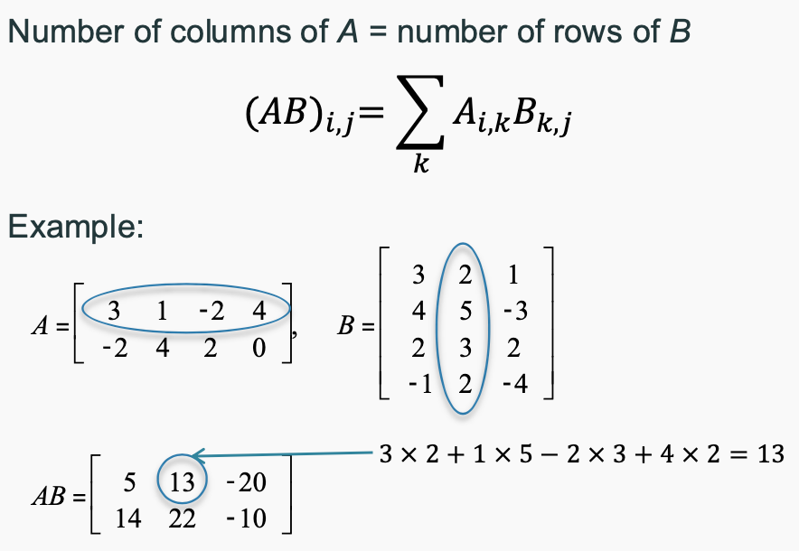
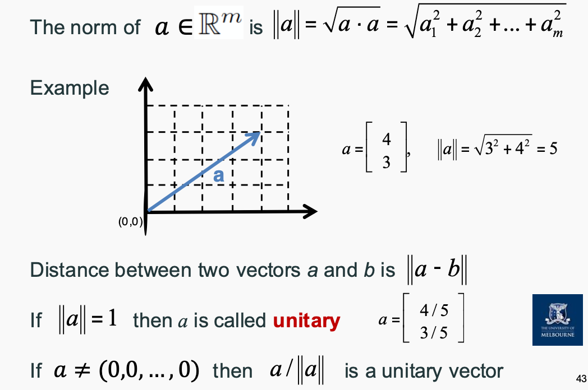
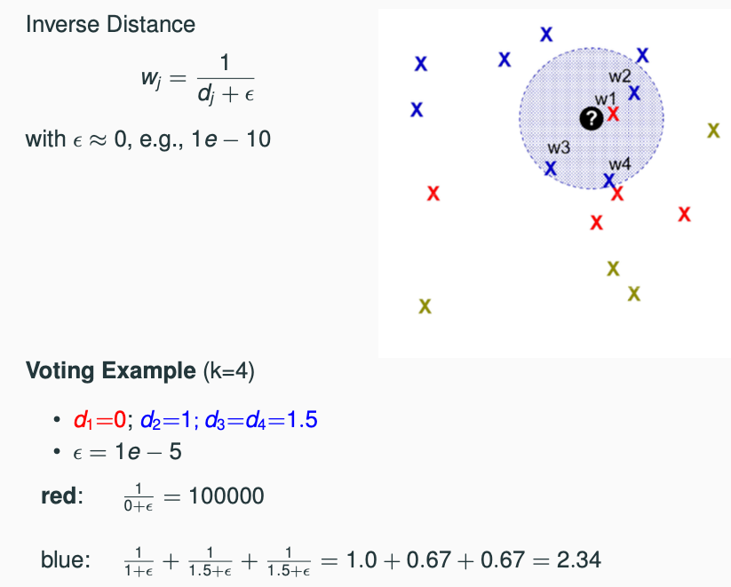
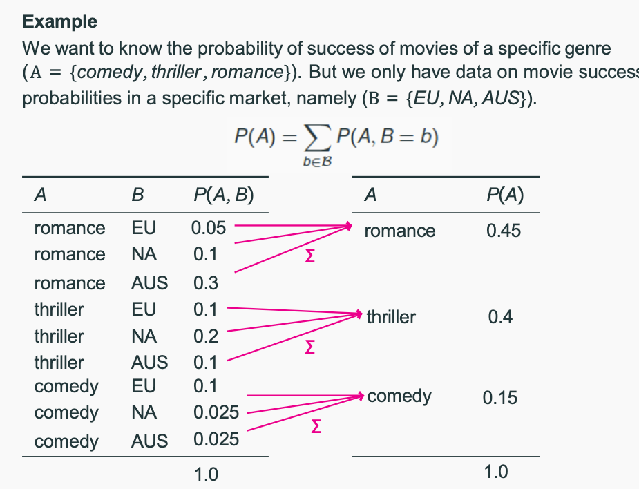
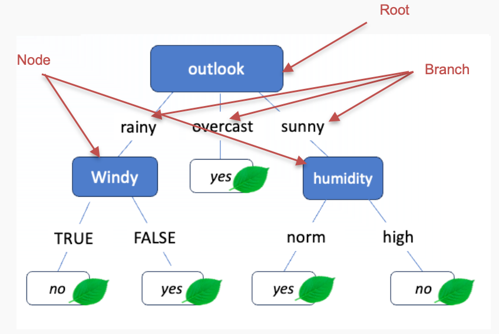
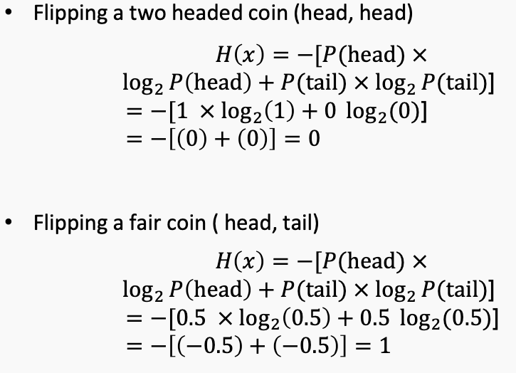
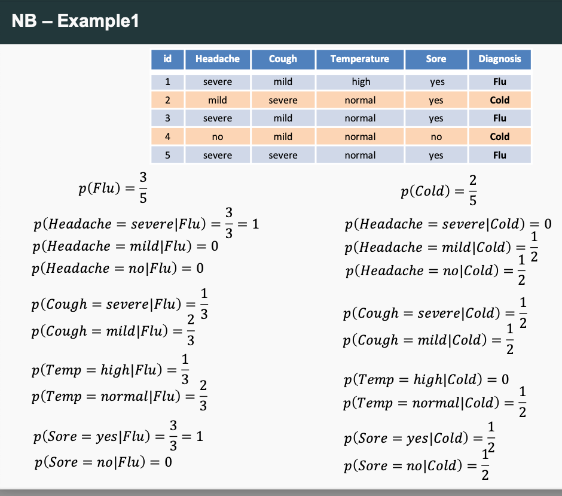
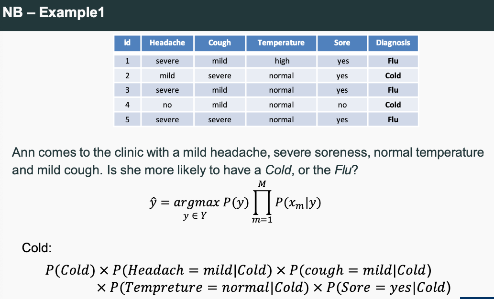
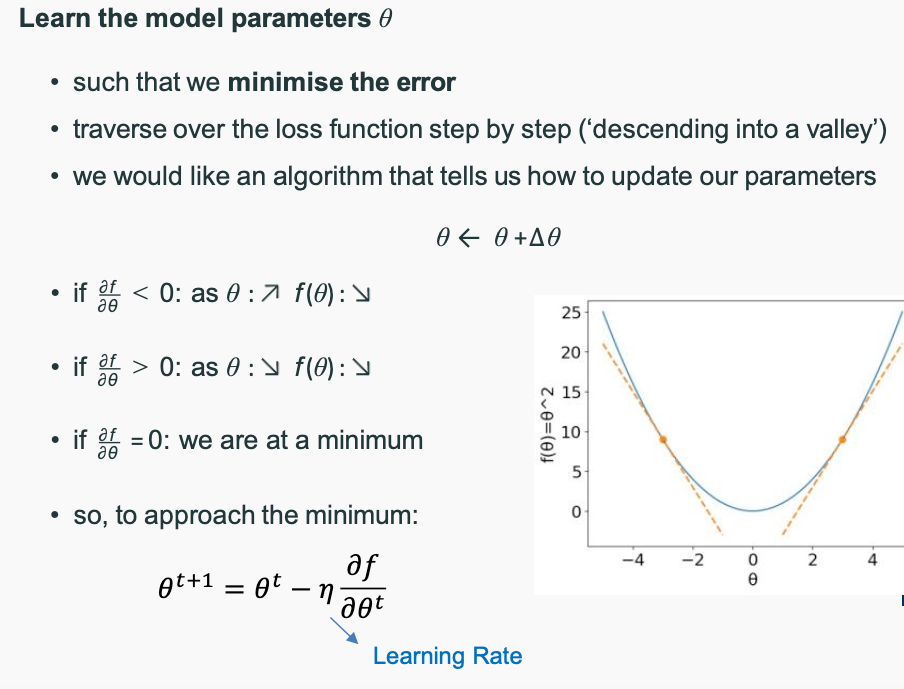
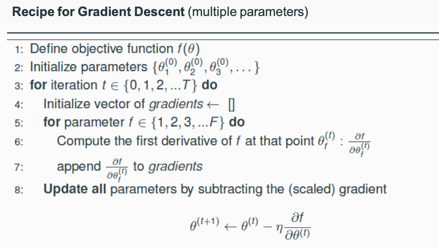

# Introduction to Machine Learning (COMP90049)

## Week 1

- Machine learning is a method of teaching software to learn from data and make decisions on their own, without being explicitly programmed.

### Three ingredients for machine learning
1. Data
• Discrete vs continuous vs ...
• Big data vs small data
• Labeled data vs unlabeled data
• Public vs sensitive data

2. Models
• function mapping from inputs to outputs
• probabilistic machine learning models
• geometric machine learning models
• parameters of the function are unknown

3. Learning
• Improving (on a task) after data is taken into account
• Finding the best model parameters (for a given task)
• Supervised vs. unsupervised learning

:::info
Supervised Learning:监督学习使用带有标签的数据进行训练，模型学习输入（features）到输出（labels）之间的映射关系。
Unsupervised Learning:无监督学习使用没有标签的数据，模型通过分析数据的模式和结构来进行学习。
:::

### Linear Algebra Review
#### Matrices
- Matrices addition/subtraction: Add(Subtract) correspond ingentries in A and B 
- Matrix multiplication: Multiply corresponding entries in A and B and sum the products

- Matrix transpose: Transpose of a matrix is obtained by interchanging its rows and columns. Matrix is **symmetric** if it is equal to its transpose.
- Matrix inverse: The inverse of a matrix A is denoted by A^-1 and is obtained by multiplying A by its inverse. 
- A matrix cannot be inverted if: More rows than columns, More columns than rows,Redundant rows/columns (linear independence)
#### Vectors
- A vector is a matrix with several rows and **one** column
- Vector addition/subtraction: Add(Subtract) corresponding entries in A and B
- Vector inner product: Multiply corresponding entries in A and B and sum the products
- Vector Euclidean norm: The square root of the sum of the squares of the entries in the vector.

- Vector inner product: The dot product of two vectors A and B is the sum of the products of their corresponding entries.
- The cosine of the angle between two vectors can be found by using norms and the inner product

### Instances, Attributes, and Learning Paradigms (Supervised vs. Unsupervised Learning)
- In ML terminology examples are called Instances
- Each instance can have some Features or Attributes
- Concepts are things that we aim to learn. Generally, in the form of labels or classes

#### Unsupervised do not have access to an inventory of classes and instead discover groups of ‘similar’ examples in a given dataset.
- Clustering is unsupervised — the learner operates without a set of labelled training data
- **Success is often measured subjectively; evaluation is problematic**

#### Supervised methods have prior knowledge of classes and set out to discover and categorise new instances according to those classes
- Classification learning is supervised
• In Classification, we can exhaustively list/enumerate all possible labels for a given instance; a correct prediction
entails mapping an instance to the label which is truly correct
- Regression learning is supervised 
• In Regression,"infinitely" many labels are possible, we cannot conceivably enumerate them; a “correct” prediction is when the numeric value is acceptably close to the true value

### Featured Data Types
1. Discrete: Nominal (Categorical)
- Values are distinct symbols, values themselves serve only as labels or names
- No relation is implied among nominal values (no ordering or distance measure)
- Only equality tests can be performed
- e.g. Student Number
2. Ordinal
- An explicit order is imposed on the values
- Addition and subtraction does not make sense
- e.g. Educational Level
3. Continuous: Numeric
- Numeric quantities are real-valued attributes
- All mathematical operations are allowed 

## Equal Width vs. Equal Frequency vs. Clustering

| Method                  | Equal Width Binning          | Equal Frequency Binning       | Clustering                   |
|-------------------------|----------------------------|------------------------------|------------------------------|
| **Definition**          | Each bin has the same width | Each bin contains the same number of data points | Groups data points based on similarity |
| **Type**               | Data discretization        | Data discretization         | Unsupervised learning       |
| **Advantages**         | Easy to compute, simple     | Suitable for skewed distributions | Can detect natural groupings in data |
| **Disadvantages**       | Sparse or dense bins if data density varies | Uneven bin width, harder to interpret | May require tuning (e.g., number of clusters) |
| **Common Algorithms**   | Fixed width intervals      | Quantiles-based binning     | K-Means, DBSCAN, Hierarchical Clustering |
| **Use Cases**          | Histogram creation, feature engineering | Handling skewed data in ML models | Customer segmentation, anomaly detection |

:::info
Equal Width Binning：用于简单离散化，每个 bin 宽度相同，但可能会导致数据密度不均衡。
Equal Frequency Binning：每个 bin 的数据量相等，适合处理偏态数据，但 bin 的宽度不一致，可能难以解释。
Clustering（聚类）：用于无监督学习，根据数据点的相似性自动分组，适合发现隐藏模式，但通常需要调整参数（如 k 值）。
:::

## Standardization vs. Normalization

| **Method**              | **Standardization (Z-score)**            | **Min-Max Normalization**         |
|-------------------------|-----------------------------------------|----------------------------------|
| **Formula**            | \( X' = \frac{X - \mu}{\sigma} \)       | \( X' = \frac{X - X_{\min}}{X_{\max} - X_{\min}} \) |
| **Range**              | Mean = 0, Std = 1                        | [0,1] or [-1,1]                 |
| **Best for**           | Normally distributed data                | Data with fixed bounds          |
| **Sensitive to outliers?** | Less sensitive                          | More sensitive                   |
| **Formula** | (X - mean) / std | (X - min) / (max - min) |
:::info
Standardization：将数据标准化到均值为 0，标准差为 1 的分布，适用于正态分布的数据。
Normalization：将数据缩放到 [0,1] 或 [-1,1] 范围内，适用于数据范围固定的数据。
:::

## Week 2
### K-Nearest Neighbors (KNN)
- supervied learning algorithm
#### KNN Classification
• Return the most common class label among neighbors
• Example: cat vs dog images; text classification; ...
#### KNN Regression
• Return the average value of among K nearest neighbors
• Example: housing price prediction;

#### To measure categorical distance, we can use:
- Hamming distance: number of positions where the two strings differ
- Jaccard Similarity: intersection over union of two sets

#### To measure numerical distance, we can use:
- Manhattan distance: sum of absolute differences between corresponding components
- Euclidean distance: square root of the sum of the squares of the differences between corresponding components
- Cosine distance: 1 minus the cosine of the angle between two vectors

#### To measure oridinal distance, we can use:
- Normalized Ranks: rank each value and normalize them to [0, 1]

#### Majority Vote

#### Inverse Distance
- Give more weight to the nearer neighbors rather than quantity.
- The bigger the weight, the more important the neighbor is.

#### Inverse Linear Distance
- Give more weight to the nearer neighbors, but with a decreasing slope.
- The bigger the weight, the more important the neighbor is.

#### Value of K
| **K Value** | **Bias**               | **Variance**            | **Overfitting**  | **Underfitting**  | **Best For**                                 |
|-------------|------------------------|-------------------------|------------------|-------------------|---------------------------------------------|
| **Small K** (e.g., K=1, K=3) | **Low Bias**: The model can closely follow the data. | **High Variance**: Sensitive to noise and outliers. | Likely to overfit due to high sensitivity to small fluctuations in the training data. | Unlikely to underfit unless the data is too noisy or simple. | - Complex data with clear patterns  - When the dataset is relatively small. |
| **Large K** (e.g., K=10, K=20) | **High Bias**: The model becomes less sensitive to variations in the data. | **Low Variance**: Smoothing out the noise by considering more neighbors. | Less likely to overfit as it smooths out fluctuations. | Might underfit if the data has complex relationships or non-linear patterns. | - Noisy data  - When a generalization is more important than capturing every detail. |
| **Medium K** (e.g., K=5, K=7) | A balanced approach with moderate bias. | Balanced variance, aiming for generalization. | Minimizes both overfitting and underfitting. | Good compromise between bias and variance. | - Standard choice for most datasets, balancing generalization and accuracy. |

#### Why KNN
- Pros
• Intuitive and simple
• No assumptions
• Supports classification and regression
• No training: new data →evolve and adapt immediately
- Cons
• How to decide on best distance functions?
• How to combine multiple neighbors?
• How to select K ?
• Expensive with large (or growing) data sets

#### Lazy Learning vs. Eager Learning

| Criteria               | Lazy Learning (e.g., KNN)                     | Eager Learning                             |
|------------------------|-----------------------------------------------|--------------------------------------------|
| **Definition**          | Delays learning until a query is made          | Learns from the training data immediately  |
| **Training Phase**      | Fast (no model building)                      | Slow (model is built during training)       |
| **Prediction Phase**    | Slow (requires processing the entire dataset)  | Fast (uses the pre-built model)            |
| **Memory Requirement**  | High (stores the entire training dataset)       | Lower (only stores the model)              |
| **Flexibility**          | High (can adapt to new data easily)            | Low (requires retraining for new data)     |
| **Example**             | K-Nearest Neighbors (KNN)                      | Decision Trees, Neural Networks            |

### Probility
- P(A=a): the probability that random variable A takes value a
- 0 <= P(A=a) <= 1
- P(True) = 1
- P(False) = 0

#### Joint Probability
- P(A, B): joint probability of two events A and B
- the probability of both A and B occurring = P(A ∩ B)

#### Conditional Probability
- P(A|B): the probability of A occurring given that B has occurred
- P(A|B) = P(A ∩ B) / P(B)

#### Independent Probability
- Two events A and B are independent if P(A|B) = P(A)
- P(A, B) = P(A) * P(B)

:::info
#### Disjoint
- P(A∩B)=0

#### Product Rule
- P(A, B) = P(A|B) * P(B) = P(B|A) * P(A)

#### Chain Rule
- P(A,B,C)=P(A)⋅P(B∣A)⋅P(C∣A,B)
:::

#### Bayes' Rule
- P(A|B) = ( P(B|A) * P(A) ) / P(B)
- Bayes’ Rule allows us to compute P(A|B) given knowledge of the ‘inverse’ probability P(B|A).

#### Marginalization

#### Probability Distributions
- Probability distributions can be discrete or continuous. 
- Discrete Random Variable: Takes on a countable number of distinct values (e.g., number of heads in coin flips). 
- Continuous Random Variable: Takes on an infinite number of possible values (e.g., height of students).

| **Distribution** | **Type** | **Range** | **Parameters** | **Formula** | **Example** | **Use Cases** |
|-----------------|----------|-----------|---------------|-------------|-------------|---------------|
| **Normal** | Continuous | −∞ to +∞ | Mean μ, Variance σ² | <code>P(x) = (1 / √(2πσ²)) * exp(-((x - μ)² / (2σ²)))</code> | Human height, exam scores | Linear regression, Gaussian models |
| **Bernoulli** | Discrete | 0, 1 | Probability p | <code>P(X = k) = p^k (1 - p)^(1 - k)</code> | Coin flip | Binary classification |
| **Binomial** | Discrete | 0 to n | Number of trials n, Success probability p | <code>P(k) = C(n, k) * p^k * (1 - p)^(n - k)</code> | Number of heads in 10 coin flips | Binary classification, hypothesis testing |
| **Multinomial** | Discrete | 0 to n for each category | Number of trials n, Probabilities p₁, ..., pₖ | <code>P(x₁, ..., xₖ) = (n! / (x₁!x₂!...xₖ!)) * ∏(pᵢ^xᵢ)</code> | Rolling a dice multiple times | Text classification, NLP |
| **Categorical** | Discrete | 1 to k | Probabilities p₁, ..., pₖ | <code>P(X = i) = pᵢ</code> | Choosing a color from a set of options | Classification, clustering |

## Week 3

### Zero-R
- A simple baseline model that predicts the most frequent class in the training data.

### One-R
- Also known as Decision stom
- Uses only one feature (“best” feature) to build a model

### Desicion Trees

### ID3 (Iterative Dichotomiser 3)
- A top-down approach that splits the data into smaller subsets based on the value of a chosen feature.

#### Entropy (measure of uncertainty. The expected (average) level of uncertainty (surprise))
- For a Low probability event: if it happens, it’s big news! Big surprise! **High information!**
- For a High probability event: it was likely to happen anyway. Not very surprising. **Low information!**
- Higher H means more uncertain.

#### Conditional Entropy measures the amount of uncertainty in X given Y.

#### Information Gain (measure of the reduction in entropy after splitting)
- Information gain measures the reduction in entropy about the target variable achieved by partitioning the data based on a given feature.
- Choose the largest as information gain.

#### Shortcomings of IG
- Overfitting: Greedy algorithm may choose a feature that is too specific and does not generalize well to unseen data.
- Gain ratio (GR) reduces the bias for information gain towards highlybranching attributes by normalising relative to the split information
- Split info (SI) is the entropy of a given split (evenness of the distribution ofinstances to attribute values)

### Naive Bayes Theory
:::info
arg max: argument of maximum value
:::

- Supervied ML method

#### Example:

- If any term P(xm|y ) = 0 then the class probability P(y|x ) = 0
- To solve this: use Laplace smoothing.

1. First Solution: We can assign a (small) positive probability 𝜀 to every unseen class-feature combination
2. Second Solution: We can add a “pseudocount” α to each feature count observed during training, often is 1.

- Probabilities are changed drastically when there are few instances; with a large number of instances, the changes are small
-  Laplace smoothing (and smoothing in general) **reduces variance** of the NB classifier because it reduces sensitivity to individual (non-)observations in the training data

### Different Naive Bayes

Naïve Bayes classifiers have several key variants that differ based on how they model the distribution of features. Below is a comparison of the most common types:

| Variant        | Assumption on Feature Distribution | Use Case |
|--------------|----------------------------------|---------|
| **Gaussian Naïve Bayes (GNB)** | Assumes features follow a Gaussian (normal) distribution. | Suitable for continuous data, often used in text classification and real-world datasets with normally distributed features. |
| **Multinomial Naïve Bayes (MNB)** | Assumes feature counts follow a multinomial distribution. | Best for text classification (e.g., spam detection, document classification) where features are word counts or term frequencies. |
| **Bernoulli Naïve Bayes (BNB)** | Assumes binary feature presence (1 = present, 0 = absent). | Used in binary text classification (e.g., sentiment analysis, spam filtering), where features represent whether a word appears in a document. |
| **Complement Naïve Bayes (CNB)** | A modification of Multinomial Naïve Bayes, designed to handle class imbalances. | Works better for imbalanced datasets and improves accuracy by adjusting feature probabilities. |
| **Categorical Naïve Bayes** | Assumes features are discrete categorical variables. | Used for classification tasks with categorical inputs that are not necessarily text-based. |

Each variant modifies the way probabilities are calculated based on the data's nature, making Naïve Bayes a flexible and effective algorithm for different types of classification tasks.

### Conclusion of Naive Bayes
1. Why does it work given that it’s a blatantly wrong model of the data?
- we don’t need the true distribution over P(y|x ), we just need to be able to identify the most likely outcome

2. Advantages of Naive Bayes
- easy to build and estimate
- easy to scale to many feature dimensions (e.g., words in the vocabulary) and data sizes
- reasonably easy to explain why a specific class was predicted
- good starting point for a classification project

## Week 4

### Linear Regression
- A supervised learning algorithm that models the relationship between a scalar dependent variable (y) and one or more explanatory variables (X1, X2,..., Xn).
- The model assumes that the relationship between the dependent and independent variables is linear.
- The goal is to find the best line that fits the data.

#### Loss Function
- The loss function measures the error between the predicted values and the actual values.
- The loss function is used to optimize the model parameters (i.e., the weights and biases) to minimize the loss.

:::info
- When using a regression model for prediction, it is important to only predict within the relevant range of data
- We should not try to extrapolate beyond the range of observed X’s
- Make sure independent variables are NOT highly correlated with each other, otherwise the model becomes unstable
:::

### Optimization
- Find parameter values 𝜽 that maximize (or minimize) the value of a function f(𝜽)

### Iterative Optimization
#### Closed-form solutions
- Previously, we computed the closed form solution for the MLE of the binomial distribution
- We follow our recipe, and arrive at a single solution
#### Unfortunately, life is not always as easy
- Often, no closed-form solution exists
- Instead, we have to iteratively improve our estimate of θˆ until we arrive at a satisfactory solution
- Gradient descent is one popular iterative optimization method

### Gradient Descent
- Descending a mountain (aka. our function) as fast as possible: atevery position take the next step that takes you most directly into the valley

:::info
1. with an appropriate learning rate, GD will find the global minimum for
differentiable convex functions
2. with an appropriate learning rate, GD will find a local minimum for
differentiable non-convex functions
:::

### Logistic Regression
| **Comparison**       | **Naïve Bayes**                         | **Logistic Regression**                  |
|----------------------|--------------------------------------|----------------------------------------|
| **Model Type**       | Generative Model                    | Discriminative Model                  |
| **Probability Learned** | \( P(x, y) \) (Joint Probability) | \( P(y | x) \) (Conditional Probability) |
| **Assumptions**      | Assumes feature independence        | No specific feature independence assumption |
| **Computational Complexity** | Low, fast computation          | Higher, requires gradient descent     |
| **Use Cases**        | Text classification (e.g., spam detection) | Tasks requiring feature relationship modeling |
| **Suitable for Large Datasets?** | Yes, simple computation   | Yes, but computationally more intensive |

:::info
# Understanding Odds and Log Odds in Logistic Regression

## 1. What are Odds?

Odds represent the ratio of the probability of an event occurring to the probability of it not occurring. Mathematically, odds are defined as:

\[
\text{odds} = \frac{P}{1 - P}
\]

where:
- \( P \) is the probability of the event occurring.
- \( 1 - P \) is the probability of the event not occurring.

### **Types of Odds**
- **Odds against an event**: When \( 0 < \text{odds} < 1 \), meaning the event is less likely to happen than not.
- **Odds in favor of an event**: When \( \text{odds} > 1 \), meaning the event is more likely to happen than not.

**Example:**
- If an event has a **60% chance** of occurring (\( P = 0.6 \)), the odds are:
  \[
  \text{odds} = \frac{0.6}{1 - 0.6} = \frac{0.6}{0.4} = 1.5
  \]
  This means the event is **1.5 times more likely** to occur than not.

## 2. Why Use Log Odds (Logit Function)?

Since odds can range from **0 to infinity**, they are not ideal for direct modeling in a regression setting. Instead, we take the **logarithm of odds**, known as the **logit function**:

\[
\text{log odds} = \log \left(\frac{P}{1 - P}\right)
\]

### **Advantages of Log Odds:**
1. **Transforms probability into an unrestricted range**  
   - \( P \) is always between \( 0 \) and \( 1 \), but log odds can take any value from **\(-\infty\) to \(+\infty\)**.
   - This makes it easier to model using linear regression techniques.

2. **Handles Non-Linearity in Probability**  
   - The relationship between probability and log odds is **non-linear**, but when transformed to log odds, it becomes **linear**.

**Example Calculation:**
- If the event has a probability of \( P = 0.8 \):
  \[
  \text{odds} = \frac{0.8}{1 - 0.8} = \frac{0.8}{0.2} = 4
  \]
  - Taking the natural logarithm:
    \[
    \log(4) \approx 1.386
    \]
  - Now, instead of dealing with probabilities, we can work with a linear scale.

## 3. Connection to Logistic Regression

In **logistic regression**, we model the probability of an event occurring using the equation:

\[
\log \left(\frac{P}{1 - P}\right) = \theta_0 + \theta_1 x_1 + \theta_2 x_2 + ... + \theta_n x_n
\]

This means:
- Instead of predicting probabilities directly, logistic regression predicts **log odds**, which follow a linear relationship with input features.
- We then use the **sigmoid function** to convert log odds back into probabilities.

## 4. Conclusion

- **Odds** measure how likely an event is compared to it not happening.
- **Log odds (logit function)** transform probabilities into a linear form, making them easier to model.
- Logistic regression leverages log odds to predict probabilities effectively.

Understanding this transformation is key to interpreting logistic regression results and making informed predictions.

:::

- Logit function: The logarithm of the odds.
### Softmax function: The function that converts a vector of real numbers to a probability distribution.

### Logistic Regression Summary
1.  Pros
- Probabilistic interpretation
- No restrictive assumptions on features
- Often outperforms Naive Bayes
- Particularly suited to frequency-based features (so, popular in NLP)
2. Cons
- Can only learn linear feature-data relationships
- Some feature scaling issues
- Often needs a lot of data to work well
- Regularisation a nuisance, but important since overfitting can be a big problem