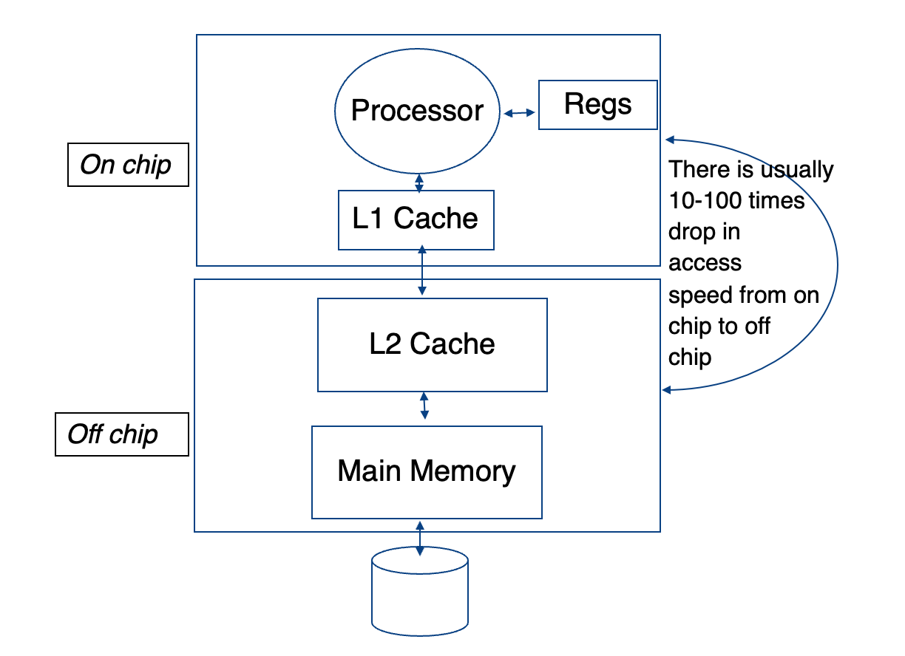
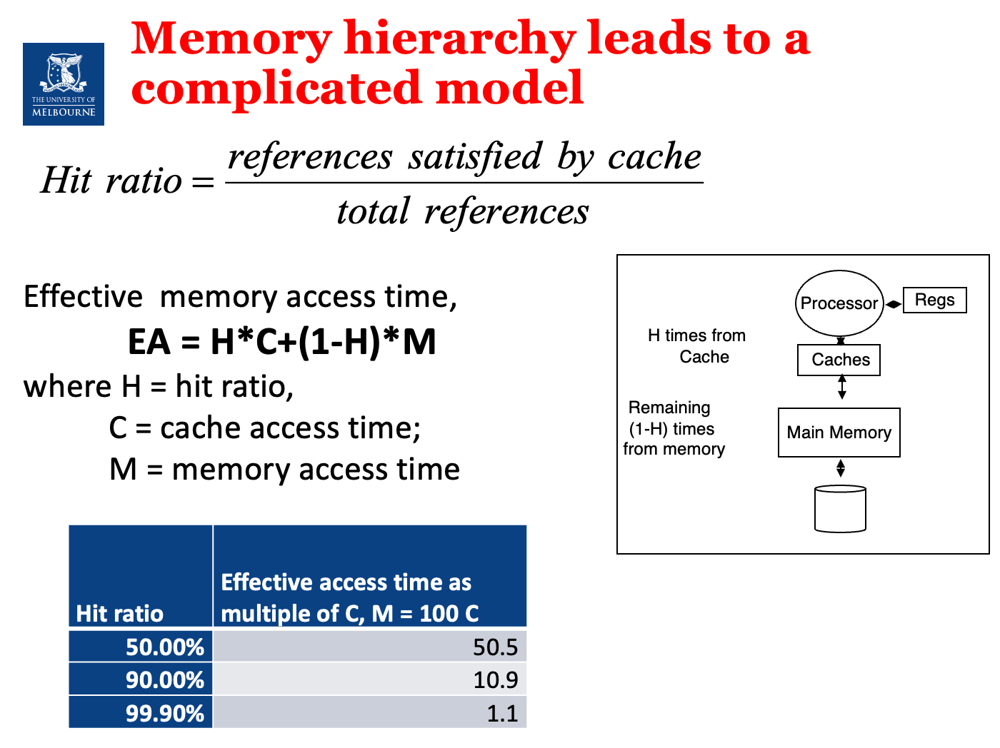

# Advanced Database Systems (COMP90050)

## Week 1

### Modelling Disk Access 
Disk access time = seek time + rotational delay + (transfer length / bandwidth)

- Seek time: the time it takes to locate the requested sector on the disk.
- Rotational delay: the time it takes to rotate the disk to the correct position.
- Transfer length: the number of bytes to be transferred.
- Bandwidth: the maximum rate of data transfer.

### HDD vs SSD
| **Feature**       | **HDD**                           | **SSD**                           |
|-------------------|-----------------------------------|-----------------------------------|
| **Storage Type**  | Magnetic disks                    | Flash memory                      |
| **Speed**         | Slower (100MB/s to 200MB/s)        | Faster (500MB/s to 5000MB/s+)     |
| **Durability**    | Less durable, susceptible to damage | More durable, resistant to shocks |
| **Capacity**      | Larger capacities (up to 10TB+)    | Smaller capacities (up to 4TB+)   |
| **Noise**         | Noisy due to moving parts          | Silent                           |
| **Power Consumption** | Higher power consumption        | Lower power consumption           |
| **Cost**          | More affordable for large storage | More expensive per GB             |
- SSD do not have seek and rotation delays.
- Moore’s law: memory chip capacity doubles every 18 months since 1970
- Joy’s law for processors: processor performance doubles every two years since 1984

### Disk Access Time
For HDD: 
- Disk Access Time = Seek Time + Rotational Delay + Transfer Time
For SSD: 
- Disk Access Time = Transfer Time
- Transfer Time = Transfer Length / Bandwidth

### Hit Ratio
- Hit ratio = (Number of hits) / (Number of requests)
- Hit ratio (HR): the percentage of requests that are satisfied by the buffer.
- If the hit ratio (HB) is high, the effective access time (EA) will be closer to the buffer access time (BC), meaning accessing data will generally be fast.
- If the hit ratio is low, the access time will be closer to the disk access time (D), meaning it will take longer to access the data, as more requests will result in disk accesses instead of buffer hits.
- Effective  memory access time, EA = H*C+(1-H)*M,where H = hit ratio, C = cache access time; M = memory access time

## Week 2
### Storage Area Networks (SANs)
- A SAN is a network of storage devices that provides a single logical storage space to multiple hosts.
- SANs are used to increase storage capacity, availability, and performance.
- They are used for shared-disk file systems
- They regularly also allow for automated back up functionality
- It was the fundamental storage for data center type systems with mainframes for decades
- Different versions evolved over time to allow for more data but fundamentals are the same even today
- They came with their own networking capabilities
- We visit a version of these when we see what can be done about failures
- In a nutshell failure probability of one disk is different to 100s of disks which requires design choices

### Deductive database systems (DDBS)
- e.g. prolog

---

### Comparison Table between Nested Loop Join and Block Nested-Loop Join

| Criteria                 | Nested Loop Join (NLJ)             | Block Nested-Loop Join (BNLJ)   |
|--------------------------|------------------------------------|---------------------------------|
| **Data Access Level**     | Record-by-record                   | Block-by-block                  |
| **I/O Cost**              | High                               | Reduced                         |
| **Seeks**                 | High                               | Lower                           |
| **Memory Requirement**    | Low                                | Higher (requires memory to store a block) |
| **Best for**              | Small tables or indexed joins      | Large tables with limited memory|
| **Performance**           | Poor for large tables              | Better for large tables         |

### Worst Case Cost Estimation
- r is called the outer relation and s is the inner relation of the join.
In the worst case, if there is enough memory only to hold one block of each table, the estimated cost is:

- **Block Transfers**:  
\[
n_r \times b_s + b_r
\]

- **Seeks**:  
\[
n_r + b_r
\]

####  Calculation Example

#### **Given:**
| Table      | Records | Blocks |
|------------|---------|--------|
| `customer` | 10,000  | 400    |
| `depositor`| 5,000   | 100    |

#### **Costs:**
| Method                | Block Transfers                      | Seeks           |
|-----------------------|--------------------------------------|-----------------|
| **Nested Loop Join**   | \( 10,000 \times 100 + 400 = 1,000,400 \) | \( 10,000 + 400 = 10,400 \) |
| **Block Nested-Loop Join** | \( 400 \times 100 = 40,000 \)       | \( 400 + 100 = 500 \)  |

### Other Join Comparison

| Criteria                | Nested-Loop Join | Block Nested-Loop Join | Indexed Nested-Loop Join | Merge Join | Hash Join |
|-------------------------|------------------|------------------------|--------------------------|------------|-----------|
| **Data Access Level**    | Record-by-record | Block-by-block         | Record-by-record (with index) | Sort and merge | Partitioning and hashing |
| **I/O Cost**             | High             | Reduced                | Low                      | Low        | Low       |
| **Seeks**                | High             | Lower                  | Low                      | Low        | Low       |
| **Memory Requirement**   | Low              | Higher (for block storage) | Low                      | Moderate   | High      |
| **Best for**             | Small tables or indexed joins | Large tables with limited memory | When the inner table has an index | When both tables are sorted | Large tables where sorting is expensive |
| **Performance**          | Poor for large tables | Better for large tables | Efficient when an index exists | Very efficient for sorted data | Efficient when no natural order of data exists |